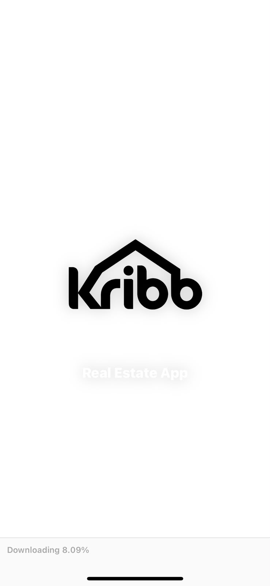
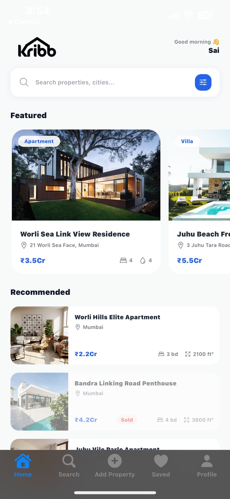
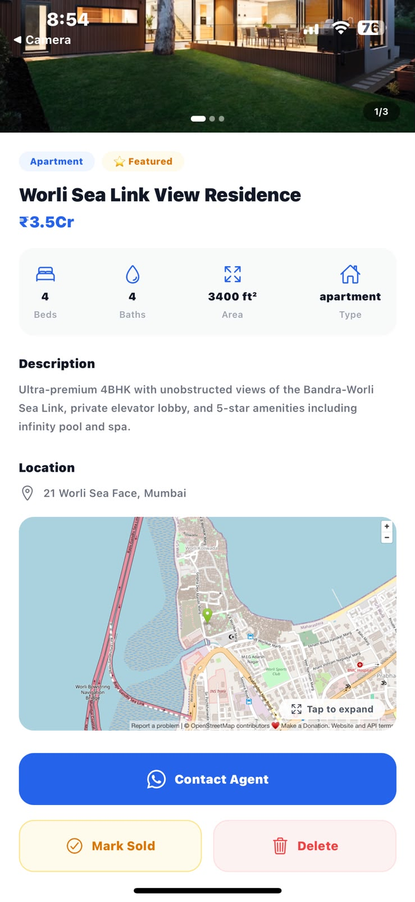
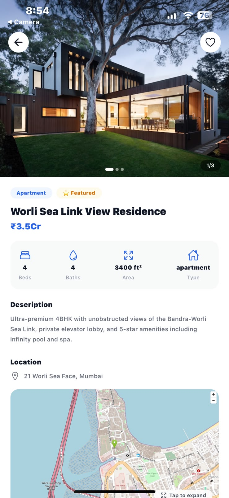

<div align="center">


# 🏡 Kribb — Real Estate, Reimagined

**A modern, full-stack React Native real estate marketplace — browse, list, save, and manage premium properties, all from your phone.**

[](https://expo.dev)
[](https://reactnative.dev)
[](https://www.typescriptlang.org/)
[](https://supabase.com)
[](https://clerk.com)
[](https://www.nativewind.dev/)

[**🚀 Live Demo**](#-live-demo) · [**📱 Screenshots**](#-screenshots) · [**✨ Features**](#-features) · [**🛠 Tech Stack**](#-tech-stack) · [**⚙️ Setup**](#️-getting-started)

</div>

---

## 📖 Overview

**Kribb** is a full-stack mobile real estate platform built with **React Native + Expo Router**, designed to feel like a premium property-listing product (think Zillow / 99acres, mobile-first). It supports two experiences in one codebase:

- 🧑‍💼 **Buyers/Users** — search, filter, browse, and save properties they love.
- 🛠️ **Admins** — list new properties, mark listings as sold, and manage inventory directly from the app.

The backend is powered by **Supabase (Postgres + Row Level Security)**, with **Clerk** handling authentication and issuing JWTs that Supabase verifies on every request — meaning every read/write is scoped and secured per-user out of the box.

---

## 📱 Screenshots

<div align="center">

| Splash Screen | Home Feed | Property Detail |
|:---:|:---:|:---:|
|  |  |  |

| Home (Recommended) | Admin — Property Controls | Profile |
|:---:|:---:|:---:|
|  |  |  |

</div>

---

## ✨ Features

### 👤 User Experience
- 🔍 **Smart Search & Filters** — search by city, property name, or use advanced filters (price, beds, baths, type)
- 🏠 **Featured & Recommended Feeds** — curated property carousels on the home screen
- 🖼️ **Image Gallery Modal** — swipeable, full-screen property photo viewer
- ❤️ **Save/Unsave Properties** — one-tap save synced live to Supabase per user
- 📍 **Interactive Map** — embedded map view with exact property location per listing
- 📞 **Contact Agent via WhatsApp** — direct deep-link to WhatsApp from any listing
- 🔐 **Secure Auth** — email/password sign-in & sign-up with MFA (email code verification) via Clerk

### 🛠️ Admin Experience
- ➕ **Add Property** — admins can list new properties directly from the app
- ✅ **Mark as Sold** — toggle listing status instantly, reflected across the app
- 🗑️ **Delete Listings** — remove properties with a confirmation-guarded action
- 🛡️ **Role-based Access** — `is_admin` flag synced from Supabase controls which UI/actions are visible

### ⚙️ Engineering Highlights
- 🔑 **Clerk ⇄ Supabase JWT bridge** — every Supabase call is authenticated with the signed-in user's Clerk token, enforced via Row Level Security — no service-role keys exposed on the client
- 🧠 **Custom Hooks** — `useSupabase`, `useUserSync`, `useSavedProperty` encapsulate all data/auth logic cleanly
- 🗂️ **File-based Routing** — Expo Router with route groups (`(auth)`, `(root)/(tabs)`) for clean navigation structure
- 🎨 **NativeWind (Tailwind for RN)** — custom design tokens (brand colors, Rubik font family) via `tailwind.config.js`
- 🏗️ **Zustand Store** — lightweight global state for user/session data

---

## 🛠 Tech Stack

| Layer | Technology |
|---|---|
| **Framework** | React Native (Expo, Expo Router) |
| **Language** | TypeScript |
| **Styling** | NativeWind (Tailwind CSS for React Native) |
| **Authentication** | Clerk (email/password + MFA) |
| **Backend / Database** | Supabase (PostgreSQL + Row Level Security) |
| **State Management** | Zustand |
| **Build & Distribution** | EAS Build (Android internal distribution), Expo Application Services |
| **Maps** | OpenStreetMap embed |

---

## 🗂️ Project Structure

```
kribb/
├── app/
│   ├── (auth)/              # Sign-in, sign-up screens
│   │   ├── sign-in.tsx
│   │   └── sign-up.tsx
│   └── (root)/
│       ├── (tabs)/          # Bottom tab navigation
│       │   ├── index.tsx        # Home feed
│       │   ├── search.tsx       # Search + filters
│       │   ├── create.tsx       # Add property (admin)
│       │   ├── saved.tsx        # Saved properties
│       │   └── profile.tsx      # User profile
│       └── property/
│           └── [id].tsx     # Property detail screen
├── components/
│   ├── PropertyCard.tsx     # Reusable property list card
│   ├── FeaturedCard.tsx     # Home feed featured carousel card
│   ├── FilterModal.tsx      # Search filter bottom sheet
│   ├── ImageGalleryModal.tsx
│   └── ImageGalleryModal.web.tsx
├── hooks/
│   ├── useSupabase.ts       # Clerk-authenticated Supabase client
│   ├── useUserSync.ts       # Syncs Clerk user → Supabase users table
│   └── useSavedProperty.ts  # Save/unsave logic per property
├── lib/
│   └── supabase.ts          # Supabase client factory
├── store/
│   └── userStore.ts         # Zustand store (isAdmin, etc.)
├── types/                   # Shared TypeScript types
├── tailwind.config.js       # NativeWind design tokens
└── app.json / eas.json      # Expo & EAS Build config
```

---

## 🚀 Live Demo

> 📱 Scan the QR code below with the **[Expo Go](https://expo.dev/go)** app to run Kribb live on your phone:

```
🔗 Live Preview: <ADD-YOUR-EXPO-SNACK-OR-EAS-UPDATE-LINK-HERE>
```

*(No install needed — instant preview via Expo Go)*

---

## ⚙️ Getting Started

### Prerequisites
- Node.js ≥ 18
- npm or yarn
- [Expo Go](https://expo.dev/go) app (for testing on a physical device)
- A [Supabase](https://supabase.com) project
- A [Clerk](https://clerk.com) application

### Installation

```bash
# 1. Clone the repository
git clone https://github.com/<your-username>/kribb.git
cd kribb

# 2. Install dependencies
npm install

# 3. Set up environment variables
cp .env.example .env
```

### Environment Variables

Create a `.env` file in the project root:

```env
EXPO_PUBLIC_CLERK_PUBLISHABLE_KEY=your_clerk_publishable_key
EXPO_PUBLIC_SUPABASE_URL=your_supabase_project_url
EXPO_PUBLIC_SUPABASE_KEY=your_supabase_anon_key
```

### Run the app

```bash
npx expo start
```

Scan the QR code with **Expo Go** (Android/iOS) or run on an emulator:

```bash
npx expo start --android
npx expo start --ios
```

### Build for Android (EAS)

```bash
eas build --platform android --profile preview
```

---

## 🔐 Authentication Flow

Kribb uses **Clerk** for auth and bridges the session directly into **Supabase**:

1. User signs in via Clerk (email/password + optional MFA).
2. Clerk issues a signed JWT for the session.
3. `useSupabase()` creates a Supabase client that attaches this JWT as the `Authorization` header on every request.
4. Supabase's **Row Level Security** policies validate the JWT and scope data access per user — meaning a user can only save/delete *their own* data, enforced at the database level, not just the UI.

---

## 👨‍💻 Author

**Sai Chandorkar**

📧 saichandorkar96@gmail.com
🔗 [LinkedIn](#) · [Portfolio](#) · [GitHub](#)

---

## 📄 License

This project is licensed under the MIT License — feel free to fork and build on it.

<div align="center">

⭐ **If you like this project, consider giving it a star!** ⭐

</div>
